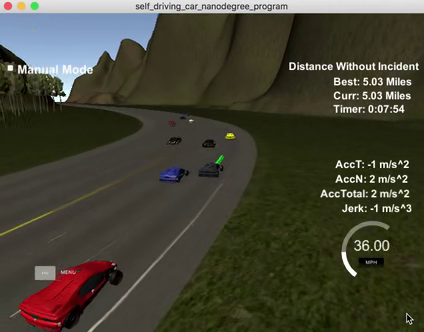
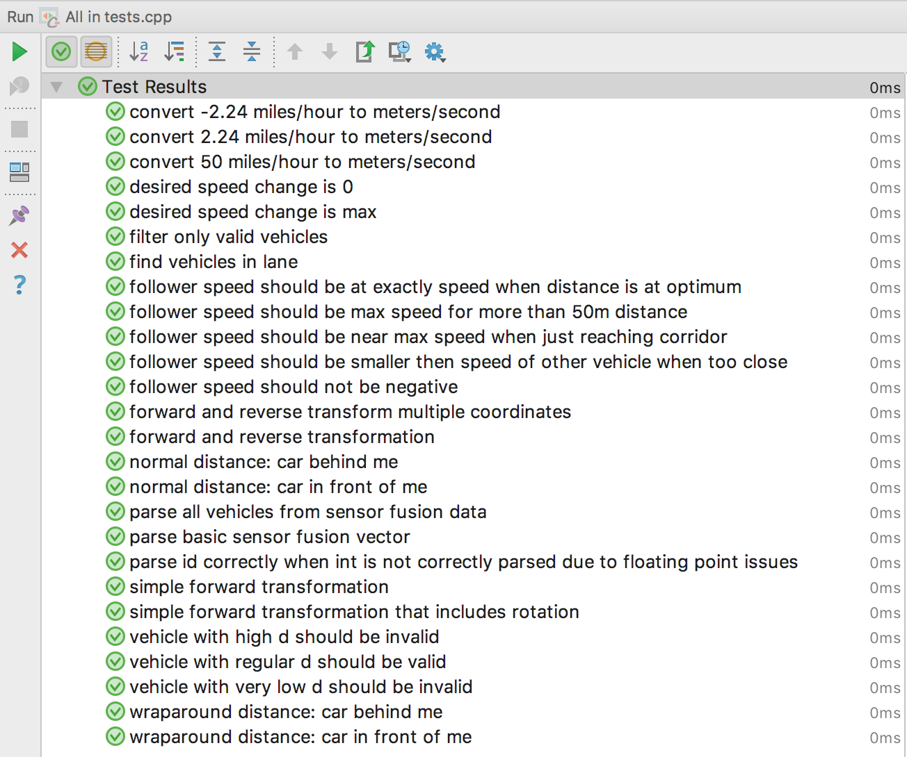

[](https://travis-ci.org/mreichelt/CarND-Path-Planning-Project)

# CarND-Path-Planning-Project

## Intro

At the heart of a self-driving car is the ability to plan a path. The car has to make decisions on its own: It has
to decide whether to change lanes, speed up or slow down and many other things.

In this scenario the car drives on a highway. It should drive 50 MPH most of the time, unless prevented by traffic, and
should change lanes when a better lane is available.

## Let's get started

To get started, I applied the suggestions of the walkthrough video of the path planning project.
By adding the [spline library](http://kluge.in-chemnitz.de/opensource/spline/) I could already generate trajectories, and I grasped a concept of how the simulator
and the algorithm interact.

## Trajectory generation

To generate the trajectory I chose this approach:

1. Get the latest planned orientation, speed and position of the car in Frenet `(s, d)` coordinates
2. Generate two next waypoints with the corresponding `d` for the desired lane with 15 meter intervals
3. Convert all of these target waypoints to absolute coordinates `(x, y)`
4. Transform these `(x, y)` points to be relative to the cars location and orientation
5. Generate a spline using these waypoints and take enough `(x', y')` coordinates to fill up the waypoint list -
  using distances appropriate for keeping a desired speed to affect for the `20ms` time gap between waypoints
6. Transform these relative `(x', y')` coordinates back to the absolute `(x, y)` coordinates

To prevent my trajectories from having acceleration or jerk above the allowed limits, I chose a more naive approach: Namely
keeping the changes in `speed` and `d` below certain thresholds, and always using the latest planned position and speed
of the car to make sure the changes were small enough.

This algorithm can be found in [main.cpp](src/main.cpp#L115-L205).

## Collision avoidance

In a first attempt I decided to always speed up when no other vehicle would be closer than 30m in front, and slow down
continuously while staying in that corridor. This had two downsides:

1. The car would speed up and slow down again all the time and never reach a stable position behind the next car
2. When a car would drive very slowly the own car would nearly come to a stop.

To solve this problem I wrote two functions:

1. [`getFollowerSpeed`](src/tools.cpp#L160-L173) finds a desired speed based on the distance to and the speed of the next vehicle
2. [`getVelocityChange`](src/tools.cpp#L180-L186) gets a velocity change value based on the wanted speed and the actual speed.

These are then called in [main.cpp](src/main.cpp#L159-L162) to get the desired target speed for the trajectory generation.

## Sensor fusion

I didn't like that all sensor fusion data was stored in a `vector<vector<double>>`, so I created the classes
[SensorFusion](src/sensorfusion.cpp) and [Vehicle](src/vehicle.cpp). That way I could access the parameters more safely
and add some useful functions, like `getSpeed`, `isInLane` and `getPredictedS`, which I used in the behavior
planning.

## Behavior planning

For planning the behavior I used two things: A state machine and a cost function. The code can be found in
[planning.cpp](src/planning.cpp).

For this project, I decided to use three states:

1. Keep the current lane
2. Change to the left lane
3. Change to the right lane

The [cost function](src/planning.cpp#L80-L95) I wrote used 3 cost functions:

1. [cost_change_lane](src/planning.cpp#L12): Keeping the current lane in general is more comfortable than changing lanes.
2. [cost_room_for_driving](src/planning.cpp#L28): A lane where the next vehicle is further away should be preferred.
3. [cost_collision](src/planning.cpp#L42): State changes that lead to collisions should be avoided.

I also used another cost function [cost_inefficiency](src/planning.cpp#L19) that was penalizing trajectories with a low
minimal speed in front of the vehicle, but I decided on not using it because the `cost_room_for_driving` worked better
for this project.

In a method called [next_state](src/planning.cpp#L117-L133) I then call the cost function for each possible trajectory
and choose the state that corresponds to the lowest cost. This is done every 3 seconds.

## Enough talking - show me the video!

[Here you go](result.mp4):

[](result.mp4)


## Discussion

In general, the assumptions I made in the project are simple enough to create a successful path planner. But I learned
quite a few things on the way:

- If I would do the project again I would choose a different approach, namely creating multiple jerk minimal trajectories
(JMTs) for each state. This would allow me to speed up / slow down purely based on cost functions. In my project, I
needed to write extra functionality to slow down when another vehicle was close, which can be error-prone and is not
safe at all for real-world usage.
- I didn't integrate a dedicated prediction of what the other vehicles were doing, which means that lane changes can
only be detected when the action is nearly complete.
- For the number of generated waypoints, I chose to decrease them from 50 to 20, effectively reducing the uncertainty
from `50 * 0.02s = 1000ms` to `400ms`. Now I know that a latency of 400ms can be critical in decision making: We should
in general plan ahead with, say, a latency of 40ms or 60ms, and then generate some more waypoints to account for planner
latency.
- Finally, I would use a different approach than the spline library, mainly because it forces the GPLv2 on all projects
using it.

## Going the extra mile

### Unit tests

I am a big fan of testing, so I wrote unit tests to test at least some methods that I needed for the project.

The tests can be found in the file [tests.cpp](tests.cpp) and can be run via the `test/Test` executable when successfully
built with CMake. They can also be run with IntelliJ/CLion, which makes for a really nice development workflow:



### Continuous integration

I tweaked the CMake files quite heavily because I added lots of source files. In order to make sure everything works,
I set up TravisCI for this project. In order to have the correct C++ coding environment I created a
[Docker image](https://hub.docker.com/r/mreichelt/carnd-cpp/) - for all future students to use and enjoy! 🎉

Checkout the [.travis.yml](.travis.yml) config that you can copy and use for your own C++ projects!

Also, you can see the [TravisCI page for this project](https://travis-ci.org/mreichelt/CarND-Path-Planning-Project).

---

   
### Simulator.
You can download the Term3 Simulator which contains the Path Planning Project from the [releases tab (https://github.com/udacity/self-driving-car-sim/releases).

### Goals
In this project your goal is to safely navigate around a virtual highway with other traffic that is driving +-10 MPH of the 50 MPH speed limit. You will be provided the car's localization and sensor fusion data, there is also a sparse map list of waypoints around the highway. The car should try to go as close as possible to the 50 MPH speed limit, which means passing slower traffic when possible, note that other cars will try to change lanes too. The car should avoid hitting other cars at all cost as well as driving inside of the marked road lanes at all times, unless going from one lane to another. The car should be able to make one complete loop around the 6946m highway. Since the car is trying to go 50 MPH, it should take a little over 5 minutes to complete 1 loop. Also the car should not experience total acceleration over 10 m/s^2 and jerk that is greater than 50 m/s^3.

#### The map of the highway is in data/highway_map.txt
Each waypoint in the list contains  [x,y,s,dx,dy] values. x and y are the waypoint's map coordinate position, the s value is the distance along the road to get to that waypoint in meters, the dx and dy values define the unit normal vector pointing outward of the highway loop.

The highway's waypoints loop around so the frenet s value, distance along the road, goes from 0 to 6945.554.

## Basic Build Instructions

1. Clone this repo.
2. Make a build directory: `mkdir build && cd build`
3. Compile: `cmake .. && make`
4. Run it: `./path_planning`.

Here is the data provided from the Simulator to the C++ Program

#### Main car's localization Data (No Noise)

["x"] The car's x position in map coordinates

["y"] The car's y position in map coordinates

["s"] The car's s position in frenet coordinates

["d"] The car's d position in frenet coordinates

["yaw"] The car's yaw angle in the map

["speed"] The car's speed in MPH

#### Previous path data given to the Planner

//Note: Return the previous list but with processed points removed, can be a nice tool to show how far along
the path has processed since last time. 

["previous_path_x"] The previous list of x points previously given to the simulator

["previous_path_y"] The previous list of y points previously given to the simulator

#### Previous path's end s and d values 

["end_path_s"] The previous list's last point's frenet s value

["end_path_d"] The previous list's last point's frenet d value

#### Sensor Fusion Data, a list of all other car's attributes on the same side of the road. (No Noise)

["sensor_fusion"] A 2d vector of cars and then that car's [car's unique ID, car's x position in map coordinates, car's y position in map coordinates, car's x velocity in m/s, car's y velocity in m/s, car's s position in frenet coordinates, car's d position in frenet coordinates. 

## Details

1. The car uses a perfect controller and will visit every (x,y) point it recieves in the list every .02 seconds. The units for the (x,y) points are in meters and the spacing of the points determines the speed of the car. The vector going from a point to the next point in the list dictates the angle of the car. Acceleration both in the tangential and normal directions is measured along with the jerk, the rate of change of total Acceleration. The (x,y) point paths that the planner recieves should not have a total acceleration that goes over 10 m/s^2, also the jerk should not go over 50 m/s^3. (NOTE: As this is BETA, these requirements might change. Also currently jerk is over a .02 second interval, it would probably be better to average total acceleration over 1 second and measure jerk from that.

2. There will be some latency between the simulator running and the path planner returning a path, with optimized code usually its not very long maybe just 1-3 time steps. During this delay the simulator will continue using points that it was last given, because of this its a good idea to store the last points you have used so you can have a smooth transition. previous_path_x, and previous_path_y can be helpful for this transition since they show the last points given to the simulator controller with the processed points already removed. You would either return a path that extends this previous path or make sure to create a new path that has a smooth transition with this last path.

## Tips

A really helpful resource for doing this project and creating smooth trajectories was using http://kluge.in-chemnitz.de/opensource/spline/, the spline function is in a single hearder file is really easy to use.

---

## Dependencies

* cmake >= 3.5
 * All OSes: [click here for installation instructions](https://cmake.org/install/)
* make >= 4.1
  * Linux: make is installed by default on most Linux distros
  * Mac: [install Xcode command line tools to get make](https://developer.apple.com/xcode/features/)
  * Windows: [Click here for installation instructions](http://gnuwin32.sourceforge.net/packages/make.htm)
* gcc/g++ >= 5.4
  * Linux: gcc / g++ is installed by default on most Linux distros
  * Mac: same deal as make - [install Xcode command line tools]((https://developer.apple.com/xcode/features/)
  * Windows: recommend using [MinGW](http://www.mingw.org/)
* [uWebSockets](https://github.com/uWebSockets/uWebSockets)
  * Run either `install-mac.sh` or `install-ubuntu.sh`.
  * If you install from source, checkout to commit `e94b6e1`, i.e.
    ```
    git clone https://github.com/uWebSockets/uWebSockets 
    cd uWebSockets
    git checkout e94b6e1
    ```

## Editor Settings

We've purposefully kept editor configuration files out of this repo in order to
keep it as simple and environment agnostic as possible. However, we recommend
using the following settings:

* indent using spaces
* set tab width to 2 spaces (keeps the matrices in source code aligned)

## Code Style

Please (do your best to) stick to [Google's C++ style guide](https://google.github.io/styleguide/cppguide.html).

## Project Instructions and Rubric

Note: regardless of the changes you make, your project must be buildable using
cmake and make!


## Call for IDE Profiles Pull Requests

Help your fellow students!

We decided to create Makefiles with cmake to keep this project as platform
agnostic as possible. Similarly, we omitted IDE profiles in order to ensure
that students don't feel pressured to use one IDE or another.

However! I'd love to help people get up and running with their IDEs of choice.
If you've created a profile for an IDE that you think other students would
appreciate, we'd love to have you add the requisite profile files and
instructions to ide_profiles/. For example if you wanted to add a VS Code
profile, you'd add:

* /ide_profiles/vscode/.vscode
* /ide_profiles/vscode/README.md

The README should explain what the profile does, how to take advantage of it,
and how to install it.

Frankly, I've never been involved in a project with multiple IDE profiles
before. I believe the best way to handle this would be to keep them out of the
repo root to avoid clutter. My expectation is that most profiles will include
instructions to copy files to a new location to get picked up by the IDE, but
that's just a guess.

One last note here: regardless of the IDE used, every submitted project must
still be compilable with cmake and make./

## How to write a README
A well written README file can enhance your project and portfolio.  Develop your abilities to create professional README files by completing [this free course](https://www.udacity.com/course/writing-readmes--ud777).

